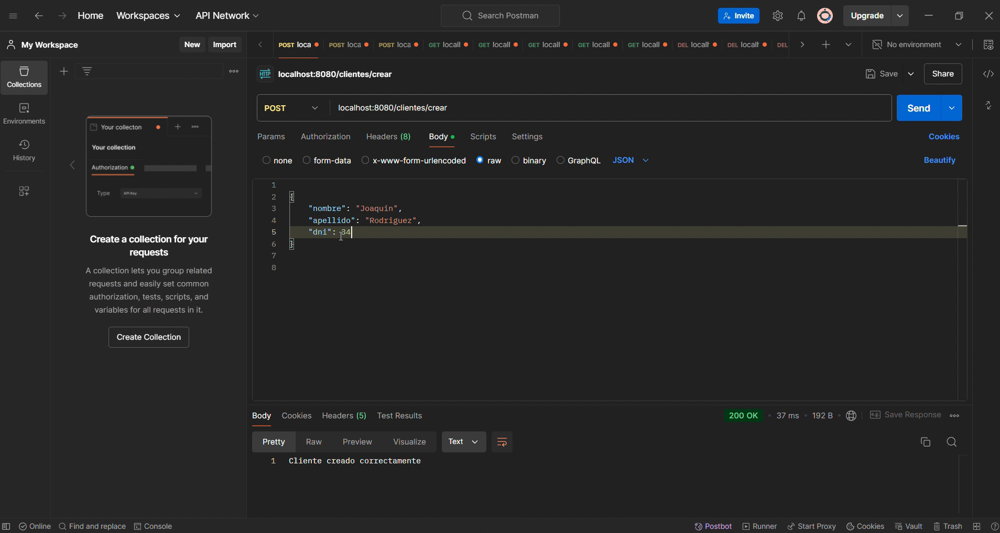

# API de Administración de Ventas - Bazar

Este proyecto es una **API REST** desarrollada con **Spring Boot** para la administración de ventas de un bazar. El objetivo del proyecto es gestionar los clientes, productos, ventas y detalles de ventas, con el fin de poner en práctica mis conocimientos y habilidades en **Java** y **Spring Boot**.

## Descripción

La API permite realizar las siguientes operaciones CRUD (Crear, Leer, Actualizar, Eliminar):

- **Clientes:** Permite registrar, obtener, actualizar y eliminar clientes.
- **Productos:** Permite registrar, obtener, actualizar y eliminar productos en el inventario del bazar.
- **Ventas:** Permite registrar una venta, asociando los productos comprados a un cliente.
- **Detalle de Venta:** Permite ver los detalles específicos de cada venta, incluyendo los productos comprados.

La API está diseñada para ser utilizada por un sistema de administración del bazar que maneja productos y clientes, permitiendo realizar ventas y llevar el control adecuado de las transacciones.

## Tecnologías Utilizadas

Spring Boot: Framework para desarrollar la API REST.

Spring Data JPA: Para interactuar con la base de datos utilizando el patrón JPA.

MySQL: Base de datos relacional para almacenar la información de clientes, productos y ventas.

Spring Web: Para manejar las solicitudes HTTP y generar respuestas.

Spring Security + JWT: Para gestionar la autenticación y autorización segura con tokens JWT.

Swagger: Para la documentación interactiva de la API.

Maven: Para la gestión de dependencias y construcción del proyecto.

Docker: Para contenerizar la aplicación y facilitar su despliegue en diferentes entornos.
## Captura del Proyecto

